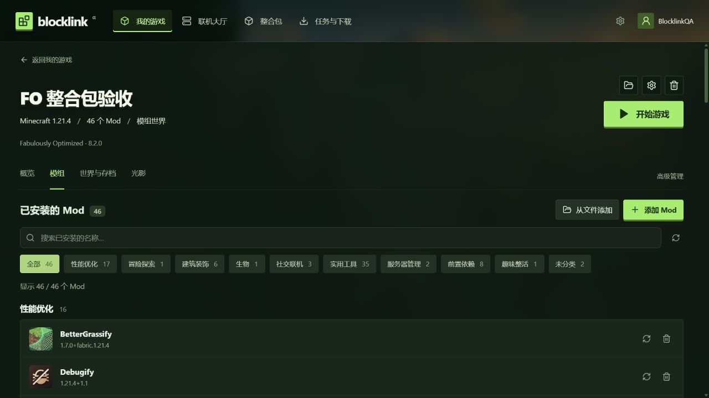

# Blocklink

**把时间留给冒险。** 轻量的 Minecraft Java 版启动器，基于 Tauri + Rust + React，不需要 Electron 或 Node 运行时。

[English](README.en.md) · [官网](https://blocklink-lobby.junjie-f33.workers.dev/) · [下载](https://github.com/marcusyang-meta/blocklink/releases) · [反馈问题](https://github.com/marcusyang-meta/blocklink/issues/new/choose)



## 可以做什么

- 自动准备 Minecraft、Java 和 Fabric / NeoForge / Forge / Quilt，分别管理不同游戏。
- 按分类、游戏版本和 Loader 浏览 Modrinth 模组与整合包，导入 .mrpack 或 HMCL / PCL 导出的完整 MCBBS ZIP。
- 相同模组下载一份、多个游戏复用，配置与存档独立。
- 管理模组分类、光影、兼容方案和恢复快照。
- 迁移原有游戏和存档，备份世界，或把世界部署为本机服务器。
- 在自己的电脑上开服，通过邀请与使用 Blocklink 的朋友联机，加入前同步服务器发布的模组。
- 简体中文 / English 即时切换，记住语言选择。

## 下载与使用

前往 [GitHub Releases](https://github.com/marcusyang-meta/blocklink/releases) 或 [官网](https://blocklink-lobby.junjie-f33.workers.dev/#download)。Windows 完整 ZIP 解压后直接运行 Blocklink.exe，需要 Windows 10/11 x64 与系统 WebView2。

选择玩家档案，创建游戏或安装整合包，然后点击「开始游戏」。所需文件会自动下载。更多步骤见 [使用指南](docs/GETTING-STARTED.md)。重要世界请保留独立备份。

**当前限制：** 微软登录流程已实现，但 Minecraft API 访问尚未获批，不能视为可用。当前本地玩家不能加入需要正版验证的服务器。CurseForge 在线来源未接入。

## 平台状态

Windows 版本已在本地测试。Linux x64、Apple Silicon 与 Intel Mac 均已通过原生构建和后台启动测试，提供预览下载。Mac/Linux 的游戏窗口、声音、输入和光影仍待实机验收。请以各 Release 的实际附件与说明为准，详见 [平台说明](PLATFORMS.md)。

## 开发与构建

安装 Rust stable、Node 24、pnpm 11，以及对应系统的 [Tauri 开发依赖](https://v2.tauri.app/start/prerequisites/)。

```sh
cd desktop
pnpm install --frozen-lockfile
pnpm build
node --test test/i18n.test.mjs
pnpm tauri build
```

在仓库根目录运行 `cargo test --workspace --locked`。桌面构建流程会生成四个平台的原生包和免安装归档；Cloudflare 大厅独立构建部署。源码仓库不包含官网下载的 EXE 和 ZIP；部署官网前需要将经过验证的发行文件放入 lobby/public/downloads/。

## 文档与反馈

[更新记录](CHANGELOG.md) · [整合包](MODPACKS.md) · [世界与服务器](WORLDS.md) · [联机](NETWORK.md) · [部署大厅](lobby/README.md) · [多语言](desktop/I18N.md) · [验收状态](VALIDATION.md)

欢迎在 [Issues](https://github.com/marcusyang-meta/blocklink/issues) 提交问题和想法，开发贡献见 [CONTRIBUTING.md](CONTRIBUTING.md)。请不要在公开反馈中附带令牌或私人邀请。

## 许可

MIT，第三方许可见 desktop/src-tauri/notices/。源码仓库不附带 Minecraft、Java 或模组二进制文件。Blocklink 是独立第三方项目，与 Mojang / Microsoft 没有隶属、赞助或背书关系。
